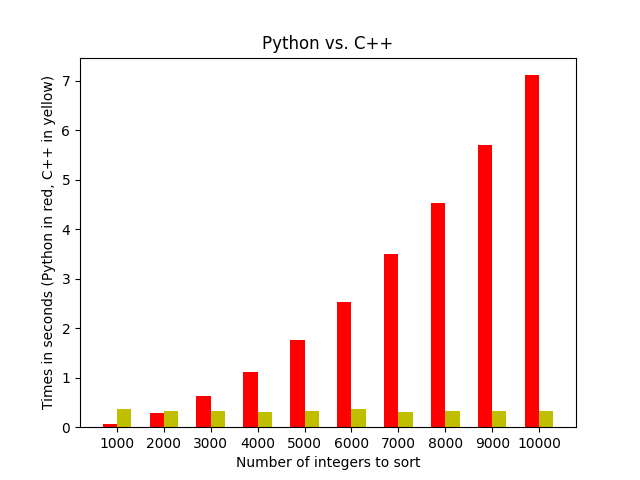

# Speed Test
### Aaron Perkel

This was an Advanced Programming assignment to compare the runtimes of Python and C++ as they bubble sort lists of numbers.

This was completed during the Spring of 2024.

## Graph

## Starter Code

For this project, I was provided with starter code:
* `numbers.txt`: a text file with a list of 10,000 random integers (taken from random.org). These will be read into the Python and C++ programs to sort.
* `BubbleSort.cpp`: a C++ source file that takes a command line argument for the number of integers to sort. Reads in that many integers from the file, sorts the numbers, and prints out the first and last ten integers from the sorted list to demonstrate that it worked properly.
* `BubbleSort.py`: a Python source file that includes the main program, which can be broken into three parts:

## Project Overview

The goal of the project is to bubble sort the same sets of unordered numbers in both Python and C++, time how long it takes each programming language to sort, and graph the results.

Since Python is interpreted and C++ is compiled, the only fair way to compare times is to include the C++ compile time in its runtime. Therefore, we will start the program in Python and Python will call C++. 

The Python file named `BubbleSort.py` includes the main program, which can be broken into three parts:
1. Run the bubble sort algorithm in Python and time how long it takes to sort.
2. Compile and run the C++ bubble sort algorithm and time how long it takes to sort.
3. Graph the runtimes.

## Running the C++ file

To run `BubbleSort.cpp` from your CLI, use the following commands:
* `g++ -std=c++1y BubbleSort.cpp` will compile the program into an executable file.
* To run the executable and give it a command line argument of 10:
    * For Windows users, the command is `a.exe 10`
    * For Mac/Linux users, the command is `./a.out 10`
    * 
## Running the Python file

To run `BubbleSort.py` from your CLI:
* The command is either `python BubbleSort.py` or `python3 BubbleSort.py`, depending on your installation of Python.

On any OS, if you get a Python import error: use pip to install the package, e.g. `pip install matplotlib` or `pip3 install matplotlib`

This program should print a bar graph of the numbers from 1 to 10 when you run it.
